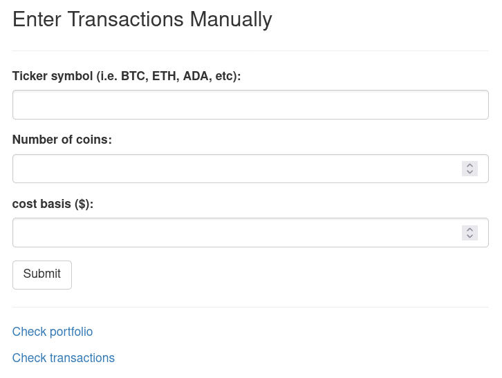
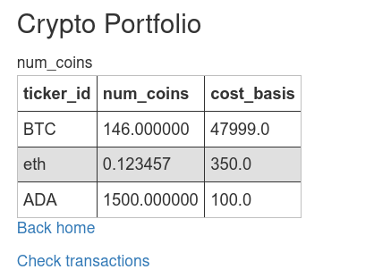
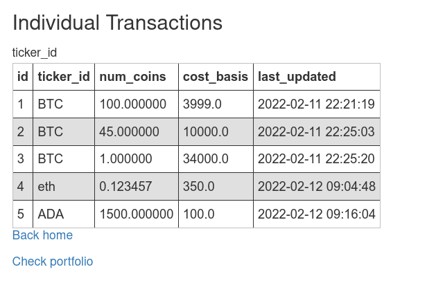

# Crypto Transaction and Portfolio Tracker

This is a sample app using Flask and SQLAlchemy that tracks a portfolio of crytocurrencies. 

Transactions are entered by hand and there are three pages in total. If you want a more in-depth explanation, I wrote a blog post [here](https://andresberejnoi.com/building-a-simple-flask-app-with-sqlalchemy/).

## Previews
The web app has three pages:
- Home
- Portfolio
- Transactions

Here are some screenshots of each.

### Home Page

### Portfolio Page

### Transactions Page
